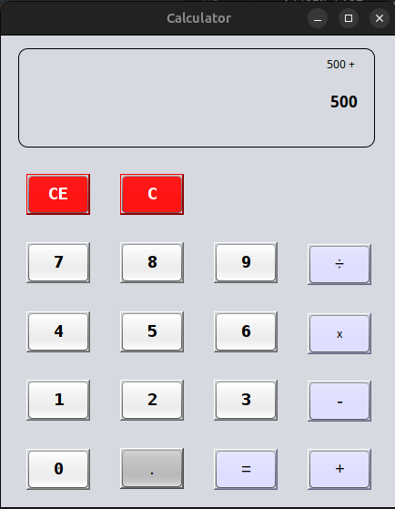

# Calculator

- WHAT?!? ANOTHER ONE?

yes, yes another one.

- WHY?

why not?

- Is it even any special?

Perhaps. Here's a list of things it can do:
  - Beautiful GUI (yes, that's a feature)
    - 
  - Proper DMAS operations
  - Clear and Clear Everything buttons ( :O )
  - Input through GUI buttons or keyboard.

- Why should I use this?
I don't think you should tbh. This was only a passion project for me to test what I can do with java

- Can I make improvements to it?
Sure, open a PR. ( It's already perfect tho :p )